# lsphere

> Circle-packing visualizations of file trees — as a CLI.


---

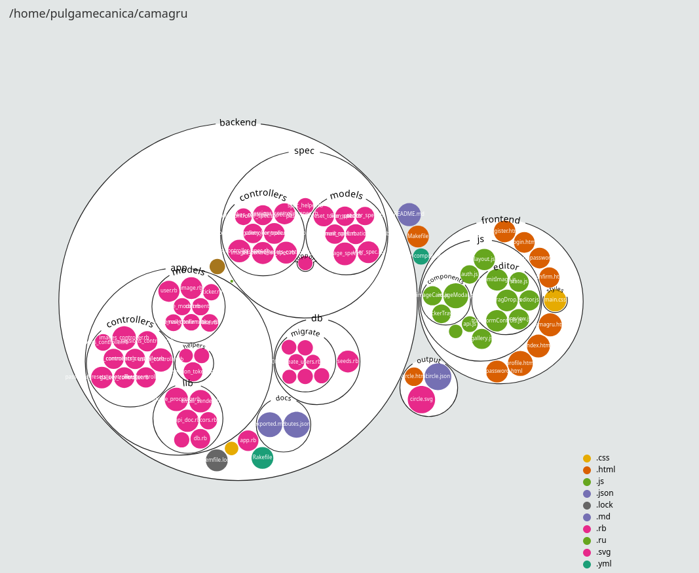

---

## What it does

`lsphere` scans a directory and renders a **circle-packing** chart of its folders and files.
It produces:

* **SVG** — a high-quality static visualization
* **JSON** — a structured snapshot of the scanned tree
* **HTML (not developed so far)** — a simple viewer that uses the JSON

Design details:

* Directories are white circles with their **name arched along the rim**, carved from the circumference (a gap in the stroke).
* Files are colored by **extension palette**, with **overrides** available.
* A **legend** lists the extensions and their colors (bottom→top) in a right-side panel.
* Sizes are log-scaled so huge files don’t swallow the layout.
* Honors `.lsignore` (plus inline ignore patterns).

---

## Install

You can run with Node or Bun. The project includes a Makefile that shells out to your chosen package manager.

### Prereqs

* **Node 18+** (or **Bun 1.0+**)
* A POSIX shell (for `make`) — optional but convenient

### Clone & build

```bash
git clone https://github.com/pulgamecanica/lsphere.git
cd lsphere

# choose one:
make deps     # installs deps (bun or npm/yarn/pnpm; defaults to bun if present)
make build    # builds dist/lsphere

# or directly:
bun install && bun run build
# or: npm ci && npm run build
```

You’ll get an executable at `dist/lsphere`.

---

## Quick start

```bash
# Render the current directory with the default settings
./dist/lsphere

# Open the SVG (Makefile helper)
make show
```

Outputs (default `--out output/`):

* `output/circle.svg`
* `output/circle.json`
* `output/circle.html` (when `--html` or `--composite`)

---

## CLI

```
Usage: lsphere [options] [path]

Arguments:
  path                        target directory (default: ".")

Options:
  -o, --out <dir>             output directory
  --svg                       emit SVG
  --html                      emit HTML viewer
  --json                      emit JSON metadata
  --png                       emit PNG (future)
  --composite                 enable svg+json+html
  -d, --depth <n>             max recursion depth (negative = unlimited)
  --dirs-only                 render only directories
  --no-dirs                   hide directory names
  --bg <color>                background color
  --palette <name>            palette name: category10|tableau10|set3|paired|dark2|accent|pastel1|pastel2|set1|set2
  --ext-colors <map>          extension color overrides, e.g. ".ts=#3178c6,.js=#f7df1e"
  --contrast <mode>           text contrast: auto|on|off
  --ignore <patterns>         space-separated patterns (quote the whole arg)
  --ignore-file <file>        ignore file path (default: .lsignore)
  --no-ignore-file            disable reading any ignore file
  --html-template <src>       default | local path | http(s) url
  --template-cache-dir <dir>  cache dir for remote templates (default: .lsphere-cache)
  --no-network                forbid network fetches for template
  --template-timeout <ms>     network timeout in ms for template fetch
  --template-hash <sha256>    optional integrity check for template
  -v, --verbose               verbose output (default: on)
  -q, --quiet                 quiet mode (alias for --no-verbose)
  -h, --help                  display help for command
```

---

## Examples

### 1) Full set of outputs

```bash
./dist/lsphere --composite ~/projects/your-repo
# → output/circle.svg, output/circle.json, output/circle.html
```

### 2) SVG only, custom background

```bash
./dist/lsphere --svg --no-html --no-json --bg "#0f0f13" .
```

### 3) Limit depth (don’t recurse forever)

```bash
./dist/lsphere --composite --depth 2 .
```

### 4) “Directories only” mode (broken... srry)

```bash
./dist/lsphere --svg --dirs-only .
```

### 5) Choose a palette & override specific extensions

```bash
./dist/lsphere --svg \
  --palette dark2 \
  --ext-colors ".ts=#3178c6,.json=#6a3d9a" .
```

### 6) Ignore patterns (inline) and/or `.lsignore`

```bash
# Inline
./dist/lsphere --svg --ignore "node_modules .git .* dist build" .

# File-based (default: .lsignore at the root)
echo "node_modules/" > .lsignore
echo ".*"            >> .lsignore
./dist/lsphere --svg .
```

### 7) HTML viewer with a remote template (cached)

```bash
./dist/lsphere --html \
  --html-template https://raw.githubusercontent.com/you/your-template/main/index.html
```

> Note: HTML implies JSON (`circle.json`) since the viewer reads it.

---

## How it looks

### Arched directory labels (stroke gap continues with text)

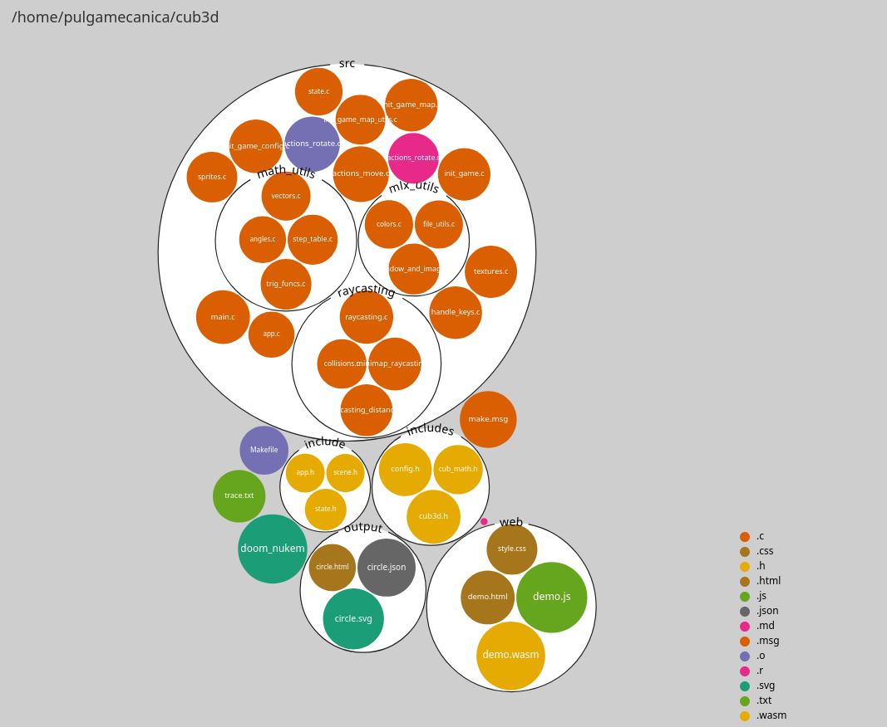

<details>
<summary>
<b>Raylib example with all the pallets</b>
</summary>

<hr>

<h2>category10</h2>

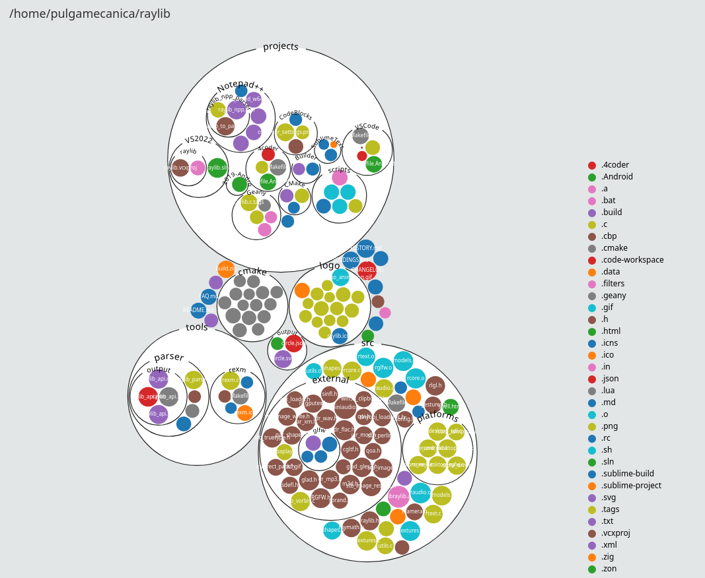
<hr>

<h2>tableau10</h2>

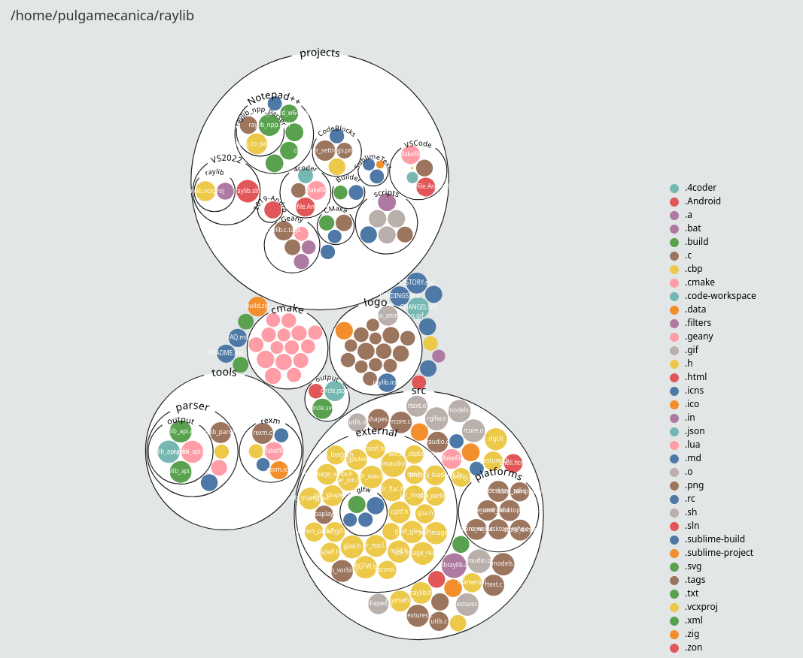
<hr>

<h2>set3</h2>

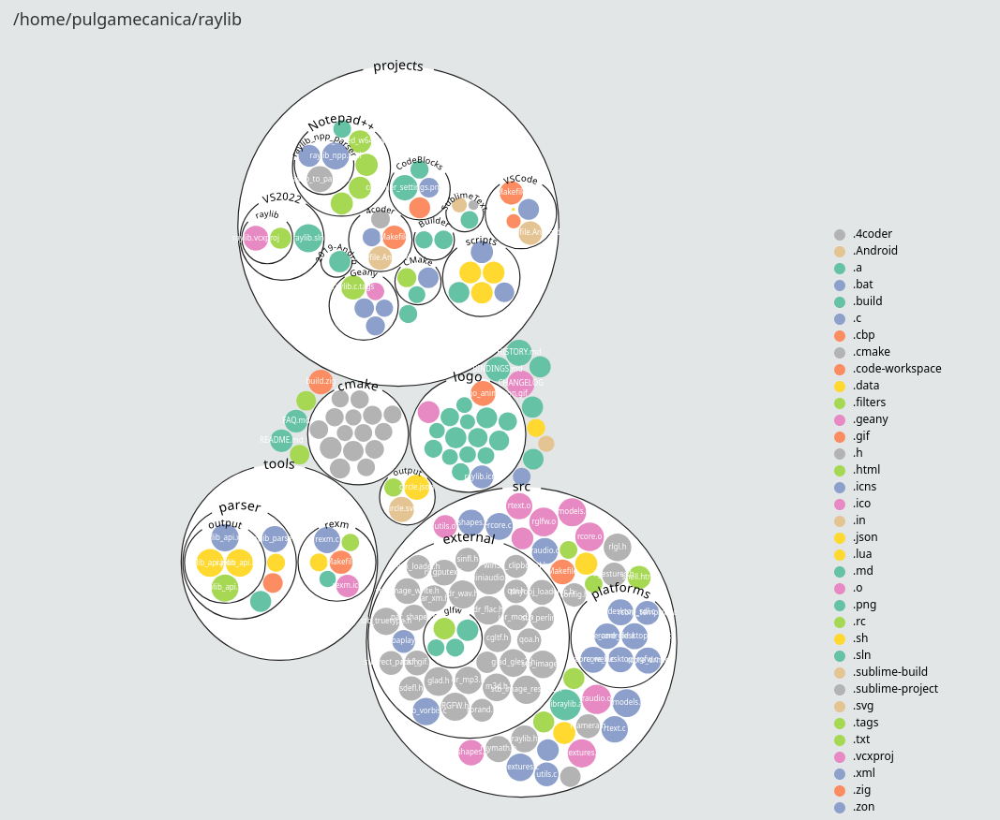
<hr>

<h2>paired</h2>

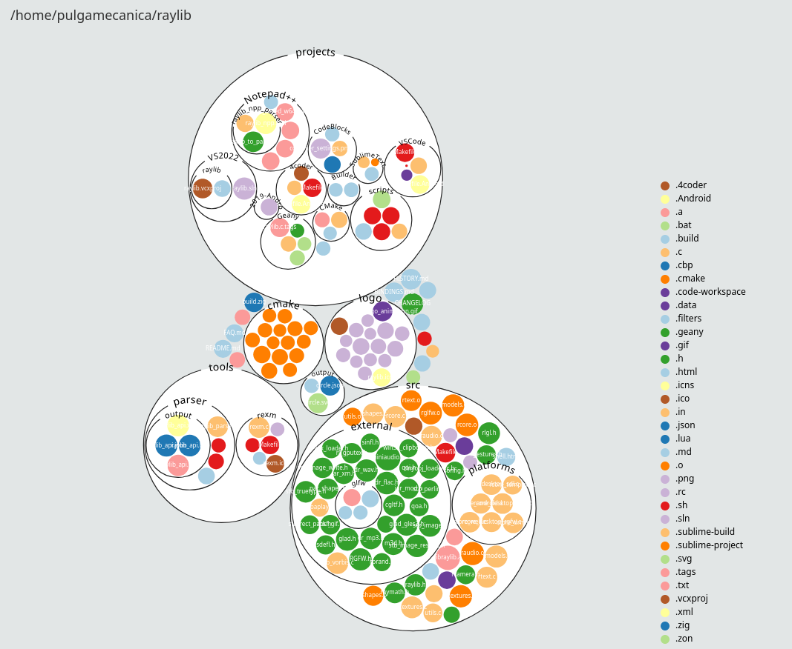
<hr>

<h2>dark2</h2>

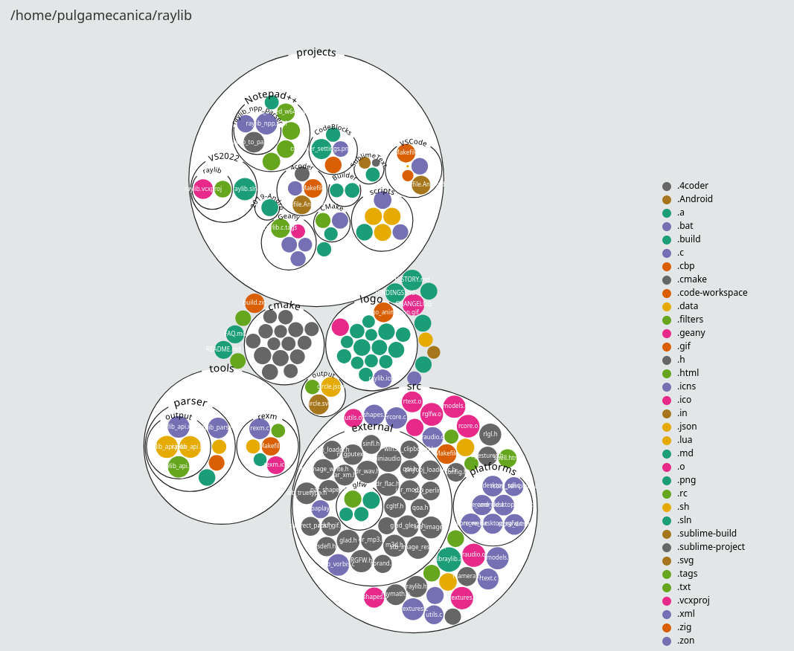
<hr>

<h2>accent</h2>

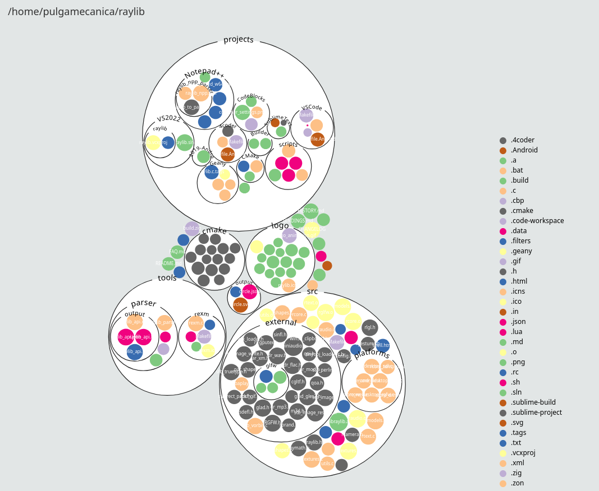
<hr>

<h2>pastel1</h2>

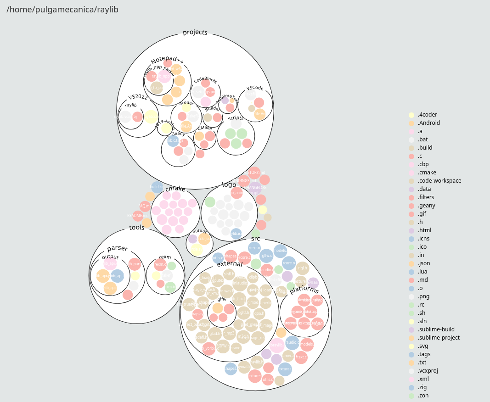
<hr>

<h2>pastel2</h2>

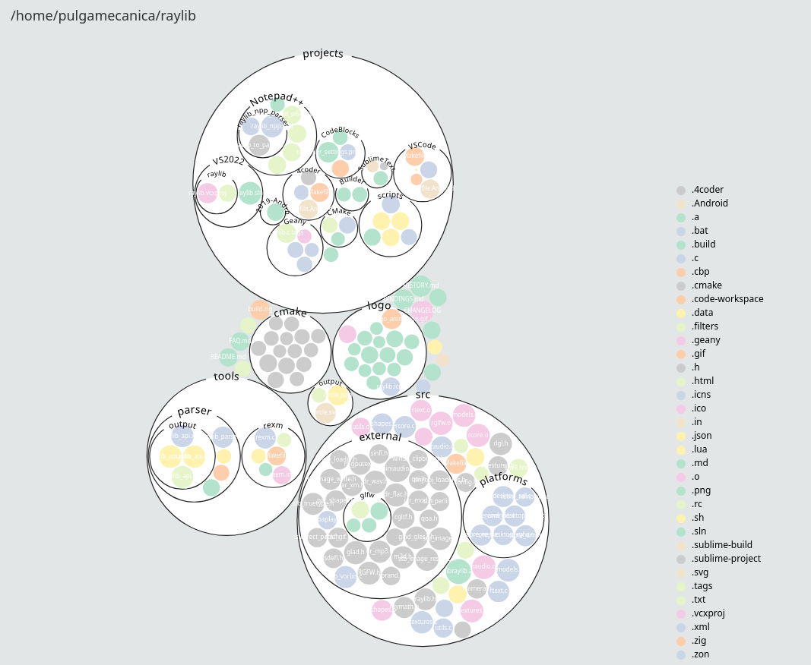
<hr>

<h2>set1</h2>

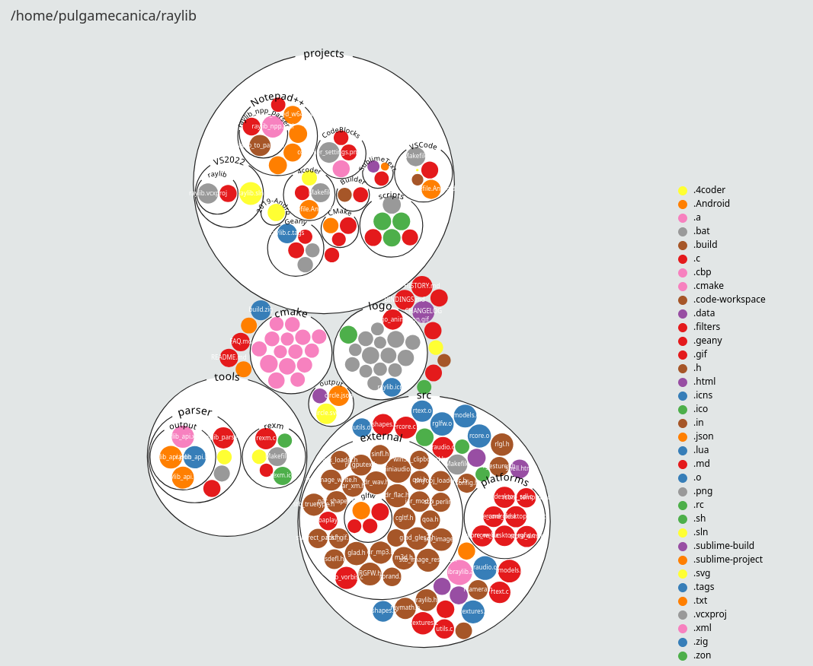
<hr>

<h2>set2</h2>

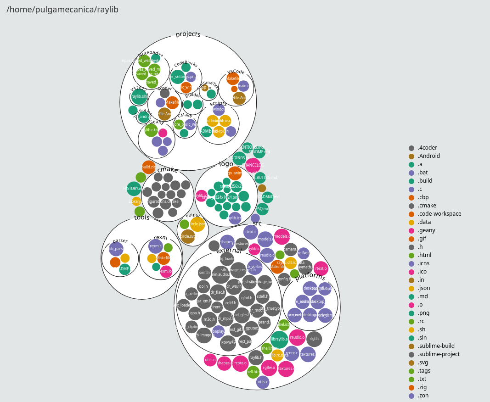
<hr>

</details>

---

## Philosophy

* **D3 everywhere**: Packing layout and sizing are created with D3, even for the static SVG.
* **CLI-first**: One command emits ready-to-share artifacts.
* **UNIXy**: Flags compose; defaults are sensible; no global config files.
* **Honest rendering**: File size range is **log-compressed** (not linear), so big files matter but don’t dominate.

---

## Make targets

```
make deps       - install dependencies
make build      - build dist/lsphere executable
make run        - run lsphere CLI (demo)
make show       - open the generated SVG
make clean      - remove dist/ and output/
make distclean  - clean + remove node_modules/
make lint       - ESLint (strict)
make format     - Prettier
```

---

## JSON snapshot

`circle.json` has both **meta** and the **tree**. Example (abridged):

```json
{
  "meta": {
    "tool": "lsphere",
    "version": "0.0.0",
    "generatedAt": "2025-09-22T12:34:56.789Z",
    "root": "/absolute/path/to/dir",
    "options": {
      "depth": -1,
      "dirsOnly": false,
      "noDirs": false,
      "bgColor": "#ffffff",
      "palette": "dark2",
      "contrast": "auto"
    }
  },
  "tree": {
    "kind": "dir",
    "name": "your-dir",
    "path": "",
    "children": [
      { "kind": "dir", "name": "src", "path": "src", "children": [ /* … */ ] },
      { "kind": "file", "name": "README.md", "path": "README.md", "size": 2048, "ext": ".md" }
    ]
  }
}
```

---

## Roadmap / TODO

* **SVG** ✅ (current focus)

  * Circle packing (D3)
  * Arched directory names with rim gaps
  * Legend panel (bottom→top)
  * Palette flag + extension overrides

* **HTML viewer** ⚠️ *todo*

  * Default embedded template (works)
  * Remote template download + caching (works)
  * Interactivity and dynamic behaviors (planned)

* **PNG** 🗓️

  * Rasterize from SVG (planned)

* **Rendering niceties**

  * Smarter label collision handling
  * Better small-file labeling heuristics
  * Optional size/percent labels

---

## Acknowledgements

* Inspired by classic **circle packing** examples in D3.
* Uses D3’s `hierarchy`/`pack`, `scaleLog`, and `d3-scale-chromatic` palettes.
* Inspired a lot on Amelia Wattenberger's work
* Check out Amelia Wattenberger's web version [https://githubnext.com/projects/repo-visualization/](https://githubnext.com/projects/repo-visualization/)

---

With love by **pulgamecanica**
